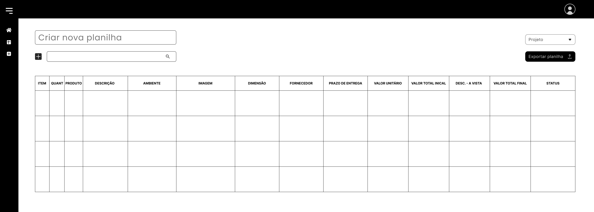

# FMA-Spreedshet

# 1. Introdução

&emsp;&emsp; A Fernanda Marques Arquitetura (FMA) é uma empresa de arquitetura que atua em projetos de arquitetura, interiores e design de produtos. Com o objetivo de criar uma área de tecnologia, fomos contratados como estagiários para identificar processos que podem ser otimizados, automatizados ou auxiliados por Inteligência Artificial dentro da empresa. Com essa premissa, realizamos várias reuniões com as diferentes áreas da empresa, como incorporação, residencial, decoração, entre outras, para entender problemas frequentes que podem ser solucionados com tecnologias.

&emsp;&emsp; A partir disso, identificamos que um desafio comum entre as áreas é a criação de planilhas de decoração. Essas planilhas são utilizadas para organizar e apresentar informações sobre os produtos que serão utilizados em um projeto de decoração, como móveis, objetos decorativos, entre outros. Elas são essenciais para a gestão do projeto e para a comunicação com os clientes. No entanto, a criação dessas planilhas pode ser um processo demorado e trabalhoso, especialmente quando envolve a coleta de produtos já utilizados em projetos anteriores, devido ao grande volume de planilhas separadas.

&emsp;&emsp; Visando solucionar essa problemática, idealizamos um projeto de desenvolvimento de um sistema que possibilite o armazenamento e a criação dessas planilhas, autocompletando as informações com base nos dados armazenados e permitindo a exportação das planilhas.

&emsp;&emsp; Este documento tem como objetivo apresentar o projeto, mostrando o mockup da interface, requisitos funcionais e não funcionais, arquitetura do sistema, banco de dados, motivações para as tecnologias utilizadas, como rodar o projeto, cronograma de desenvolvimento e custo. 

# 2. Problema

&emsp;&emsp; Durante a análise dos processos internos da Fernanda Marques Arquitetura (FMA), identificou-se que a criação de planilhas de decoração representa um dos principais gargalos operacionais. Essas planilhas, fundamentais para organizar os produtos utilizados em projetos decorativos e apresentar essas informações de forma estruturada aos clientes, são elaboradas manualmente por diferentes áreas da empresa. O processo exige a constante busca por referências de projetos anteriores, muitas vezes dispersas em diversos arquivos e planilhas separadas, o que torna o trabalho repetitivo, demorado e sujeito a erros. Essa dificuldade impacta diretamente na produtividade das equipes e na eficiência da comunicação com os clientes.

# 3. Objetivo 

&emsp;&emsp; O objetivo deste projeto é desenvolver um sistema que centralize, organize e automatize o processo de criação de planilhas de decoração. A solução visa armazenar os dados de produtos já utilizados em projetos anteriores, permitindo que novas planilhas sejam geradas com preenchimento automático a partir desse banco de dados. Além disso, o sistema possibilitará a exportação das planilhas de forma prática e padronizada, otimizando o fluxo de trabalho e promovendo maior agilidade, precisão e consistência na entrega dos projetos aos clientes.

# 4. Interface 

&emsp;&emsp; A interface do projeto foi desenvolvida com foco na experiência do usuário, garantindo acessibilidade, clareza e coerência visual. A seguir, são apresentados os principais elementos que compõem a identidade visual da aplicação, bem como os mockups das telas, que demonstram como essas escolhas se materializam na prática.

## 4.1 identidade Visual 

&emsp;&emsp; A identidade visual é a representação gráfica e estética de um projeto, composta por elementos como cores, tipografia, ícones e estilo de componentes. Ela tem como objetivo transmitir a personalidade do produto, gerar reconhecimento e garantir uma comunicação visual coerente. No contexto deste projeto, a identidade visual foi pensada para alinhar-se à proposta da aplicação e proporcionar uma experiência agradável e intuitiva ao usuário.

### 4.1.1 Paleta de cores

&emsp;&emsp; A paleta de cores foi criada com base no [site oficial do escritório](https://fernandamarques.com.br/), sendo as cores:

- #000000
- #FFFFFF
- #3D3D3D
- #858585

&emsp;&emsp; Porém, a interface não se prende apenas a essas cores, podendo ter algumas outras variações de cinza.

### 4.1.2 Tipografia

&emsp;&emsp; Para a tipografia, usamos 02 fontes: Poppins e Inter. Para o título utilizamos Poppins tamanho Regular, para subtítulo, Poppins Light e, por fim, para o conteúdo da página, utilizamos a fonte Inter tamanho  Extra Light, podendo, também, variar de acordo com as necessidades.

# 4.2 Mockup

&emsp;&emsp; Mockup é uma representação visual de como será a interface do projeto, simulando de forma realista a aparência e o funcionamento das telas, permitindo visualizar o design antes do desenvolvimento, facilitando ajustes, validações e testes com usuários. Os mockups ajudam a alinhar expectativas entre equipe técnica, designers e stakeholders, além de antecipar a experiência do usuário com o produto final. Neste projeto, os mockups foram criados com base na identidade visual definida, priorizando clareza, usabilidade e organização das informações.

&emsp;&emsp; No contexto da funcionalidade de ‘Planilha de Decoração’ presente na plataforma, o fluxo começa com a tela de Login, contendo apenas a logo da empresa, dois espaços para input (e-mail e senha) e um botão para entrar e continuar o fluxo.

&emsp;&emsp; Então, depois de feito o login, o usuário é direcionado para a tela de selecionar qual serviço será utilizado: Gerenciamento de Projetos ou Planilha de Decoração.

&emsp;&emsp; Assim que selecionado a opção Planilha de Decoração, o usuário é levado para, basicamente, a tela de home dessa funcionalidade da plataforma, onde mostra todas as planilhas feitas, podendo ser ordenadas por data de criação ou filtrar por tipo de projeto. Também, contém um espaço de input para pesquisar uma planilha pelo nome, um botão para criar uma nova planilha e a sidebar - que tem as opções de voltar para a tela de seleção de serviço, ir para a tela de planilhas ou criar uma nova planilha.

&emsp;&emsp; Depois de clicar no botão no canto superior direito ‘Nova Planilha’, o usuário é levado para a tela de criação de planilha, onde pode-se colocar um nome para o documento, associá-la a um projeto e exportar a planilha como .xlsx.

&emsp;&emsp; A tela conta com um scroll, apenas no espaço da tabela, para facilitar a construção e visualização da planilha. Também, há um espaço de input para que o usuário procure o item que deseja adicionar a planilha, e se o item não estiver inserido no banco de dados da aplicação, utilizando o botão com um símbolo de + no lado esquerdo do espaço de input, o usuário pode adicionar um novo item. 

&emsp;&emsp; Por fim, o usuário pode visualizar, editar e exportar tabelas já prontas.

&emsp;&emsp; Para mais informações e detalhes, acesse o [Figma](https://www.figma.com/design/8zRty33UBsb7KS0XHPInTm/FMA?node-id=7-2&t=BV7HmyztEZ38X6K9-1) do projeto.

# 5. Requisitos Funcionais e Não Funcionais

### Requisitos Funcionais

- **RF01**: O sistema deve permitir que o usuário crie, edite, exclua e exporte planilhas em formato Excel (.xlsx).

- **RF02**: O sistema deve permitir o cadastro, edição e exclusão de produtos, contendo informações como nome, categoria, preço e outras características relevantes.

- **RF03**: O sistema deve permitir a busca por produtos já cadastrados durante a inserção de novos produtos em uma planilha.

- **RF04**: O sistema deve permitir o cadastro, edição e exclusão de clientes.

- **RF05**: O sistema deve permitir a assosiação de uma planilha a um cliente.

- **RF06**: O sistema deve permitir que colaboradores realizem login com autenticação segura.

## Requisitos Não Funcionais

### Segurança 

- **RNF01**: O sistema deve utilizar autenticação com senha criptografada para login de colaboradores.

- **RNF02**: O sistema deve expirar a sessão do usuário após 15 minutos de inatividade.

- **RNF03**: O acesso a funcionalidades deve ser controlado por níveis de permissão (ex: administrador, colaborador).

### Desempenho 

- **RNF04**: O tempo de resposta para operações de busca não deve ultrapassar 2 segundos para até 1.000 produtos cadastrados.

- **RNF05**: A exportação de planilhas deve ser concluída em no máximo 5 segundos para planilhas com até 10.000 linhas.

### Usabilidade

 - **RNF06**: O sistema deve fornecer mensagens de erro claras e orientações para o usuário em caso de falha.

### Compatibilidade e Integração

- **RNF07**: O sistema deve permitir a importação e exportação de dados em formato Excel compatível com Microsoft Excel 2010 ou superior.

- **RNF08**: O sistema deve ser compatível com os navegadores mais utilizados (Chrome, Firefox, Edge e Safari), nas versões mais recentes.

### Disponibilidade e Acesso

- **RNF09**: O sistema deve estar disponível 99,5% do tempo em horários comerciais (8h às 21h).

- **RNF10**: O sistema deve ser acessível via navegador web sem necessidade de instalação local
